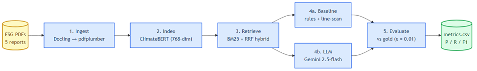

# NLP ESG KPI Extraction

Coursework deliverable, Team B — a side-by-side **rule-based vs. LLM**
pipeline that extracts three numerical KPIs from corporate sustainability
PDFs and measures both extractors against a hand-labelled gold set.

| KPI                       | Canonical unit |
|---------------------------|----------------|
| Scope 1 emissions         | `tCO2e`        |
| Total energy consumption  | `MWh`          |
| Water consumption         | `m3`           |

Five FY2025 reports (BP, Shell, Enel, Eni, Iberdrola) × three KPIs =
**15 gold cells**. Both extractors share the same retrieval layer
(hybrid BM25 + ClimateBERT embeddings, RRF-fused across multiple query
phrasings) and the same parsed input. They differ only in *how* they
turn retrieved pages into a value:

- **Baseline** — deterministic rules: cosine-matched table headers,
  per-KPI negative tokens, year-column detection, robust unit
  canonicalisation, a page-line scanner as a fallback.
- **LLM** — strict tool-use schema (`record_kpi`) over Anthropic Claude
  or Google Gemini, with KPI-scoped disambiguation rules in the system
  prompt. Every call is logged to disk for auditability.

---

## Pipeline



1. **Ingest** — Docling-first (CUDA-accelerated, page-range batched), pdfplumber fallback.
2. **Index** — ClimateBERT mean-pool embeddings (768-dim) per sentence + per table-header string.
3. **Retrieve** — hybrid BM25 + RRF over 3 KPI query phrasings; top-25 pages to baseline, top-16 to LLM.
4a. **Baseline extractor** — table-first rules + line-scan fallback; deterministic.
4b. **LLM extractor** — Gemini 2.5-flash (canonical) with `temperature=0`, tool-use schema.
5. **Evaluate** — per-extractor P/R/F1 vs gold, ε = 0.01.

---

## Headline results

| Run                                  | Correct (TP) | F1 macro | Run dir                                  |
|--------------------------------------|--------------|----------|------------------------------------------|
| Baseline + pdfplumber                | 12 / 15      | 0.88     | `data/runs/v9_magnitude_tiebreak/`       |
| **Baseline + Docling**               | **14 / 15**  | **0.96** | `data/runs/v_docling_baseline_only/`     |
| LLM (Gemini 2.5-flash) + pdfplumber  | 12 / 15      | 0.88     | `data/runs/v_gemini_25flash_post_quota/` |
| LLM (Gemini 2.5-flash-lite) + pdfplumber | 8 / 15   | 0.66     | `data/runs/v_gemini_post_quota/`         |
| **Best-of-either** (Docling baseline ∪ flash LLM) | **15 / 15** | **1.00** | union of the Docling baseline and the flash LLM run |

Per-KPI on the canonical run:

| KPI                       | Baseline (Docling) | LLM (flash) | Best-of-either |
|---------------------------|--------------------|-------------|----------------|
| Scope 1 emissions         | 4 / 5              | 5 / 5       | 5 / 5          |
| Total energy consumption  | 5 / 5              | 4 / 5       | 5 / 5          |
| Water consumption         | **5 / 5**          | 3 / 5       | 5 / 5          |
| **Total**                 | **14 / 15**        | 12 / 15     | **15 / 15**    |

Full per-cell × per-method scorecard in
`docs/PROJECT_OVERVIEW.md` §3.

---

## Setup from a fresh laptop

The whole project is one Python package. These instructions assume a
fresh machine.

### 1. Prerequisites

- **Python 3.11 or newer** (`python --version`).
- **git** (`git --version`).
- ~5 GB free disk for model weights + caches.
- *Optional but strongly recommended:* an **NVIDIA GPU** with 6 GB+
  VRAM and a working CUDA driver. Without a GPU, Docling parses the
  full corpus in ~7 hours instead of ~53 minutes; everything else
  works on CPU.

### 2. Clone and install

```bash
git clone https://github.com/rotask/nlp-esg-extractor.git
cd nlp-esg-extractor
pip install -e ".[dev]"
```

This installs the runtime dependencies (pdfplumber, sentence-transformers,
torch, anthropic, google-genai, docling, rank-bm25, pandas) plus pytest
and nbformat. **Run every command below from this directory** — paths
are relative to the repo root.

### 3. (Optional) Switch to CUDA torch for GPU acceleration

If you have an NVIDIA GPU, replace the CPU-only torch with the matching
CUDA build to enable Docling GPU acceleration:

```bash
# Check your driver supports CUDA 12.x
nvidia-smi

# Replace torch with the CUDA 12.6 build
pip uninstall -y torch torchvision
pip install torch==2.11.0 torchvision==0.26.0 \
    --index-url https://download.pytorch.org/whl/cu126

# Verify
python -c "import torch; print('cuda:', torch.cuda.is_available())"
```

Docling will pick up CUDA automatically (`AcceleratorDevice.CUDA`).
ClimateBERT embeddings also use the GPU. Override with
`NLP_ESG_DOCLING_DEVICE=cpu` if needed.

### 4. Configure API keys

Copy the template and fill in the provider you intend to use:

```bash
cp .env.example .env
# edit .env, set GEMINI_API_KEY (or ANTHROPIC_API_KEY)
```

Variables consumed by the code:

| Variable               | Default              | Required when                                  |
|------------------------|----------------------|------------------------------------------------|
| `LLM_PROVIDER`         | `anthropic`          | always (one of `anthropic`, `gemini`)          |
| `ANTHROPIC_API_KEY`    | —                    | `LLM_PROVIDER=anthropic`                       |
| `ANTHROPIC_MODEL`      | `claude-sonnet-4-6`  | optional override                              |
| `GEMINI_API_KEY`       | —                    | `LLM_PROVIDER=gemini` (`GOOGLE_API_KEY` ok too)|
| `GEMINI_MODEL`         | `gemini-2.5-flash`   | optional override (recommend `gemini-2.5-flash`) |
| `EMBEDDING_MODEL`      | `climatebert`        | optional (`minilm` is the alternative)         |

`NLP_ESG_DISABLE_DOCLING=1` is a process-level env var (not loaded from
`.env`). Setting it forces the pdfplumber-only ingest path.

### 5. Drop the report PDFs in place

PDFs are git-ignored. Download each of the five public reports from
the links below and save them under `data/reports/` with the exact
filename in the second column:

| Company   | Save as                      | Source PDF (publicly accessible)                                                                                                                                                                                                                            |
|-----------|------------------------------|--------------------------------------------------------------------------------------------------------------------------------------------------------------------------------------------------------------------------------------------------------------|
| bp        | `bp_2025.pdf`                | [BP ESG Datasheet 2025](https://www.bp.com/content/dam/bp/business-sites/en/global/corporate/pdfs/sustainability/group-reports/bp-esg-datasheet-2025.pdf) (paired with the BP Sustainability Report 2025 — the datasheet carries the structured KPI tables) |
| shell     | `shell_2025.pdf`             | [Shell Annual Report and Accounts 2025](https://www.shell.com/investors/results-and-reporting/annual-report/_jcr_content/root/main/section/promo/links/item0.stream/1774544186011/5727c329a58b5eb7a54442c0a03f562a5aef1159/shell-annual-report-2025-interactive.pdf) |
| enel      | `enel_2025.pdf`              | [Enel Integrated Annual Report 2025](https://www.enel.com/content/dam/enel-com/documenti/investitori/informazioni-finanziarie/2025/annuali/en/integrated-annual-report_2025.pdf)                                                                            |
| iberdrola | `iberdrola_2025.pdf`         | [Iberdrola Consolidated Statement of Non-Financial Information (SNFI) and Sustainability Report 2025](https://www.iberdrola.com/documents/20125/5613162/gsm26-sustainability-report-2025.pdf)                                                              |
| eni       | `eni_2025.pdf`               | [Eni Annual Report 2025](https://www.eni.com/content/dam/enicom/documents/eng/reports/2025/ar-2025/Annual-Report-2025.pdf)                                                                                                                                  |

Resulting layout:

```
data/reports/
├── bp_2025.pdf
├── enel_2025.pdf
├── eni_2025.pdf
├── iberdrola_2025.pdf
└── shell_2025.pdf
```

The filename keys (`bp`, `enel`, `eni`, `iberdrola`, `shell`) are
parsed by the dispatcher; a different name will not be recognised.

**Filename year matches the most-recent data column.** All five reports
are 2025 publications; the filename year (`_2025.pdf`) and the gold
`report_year` / `reporting_year` columns both refer to the most-recent
data column the table publishes — labelled "2025" in every report. The
prior data column ("2024") is also visible in most tables but is not
the gold-target. The baseline's `_find_year_col` caps candidate years
at `report_year`, so milestone columns that some tables also include
(Iberdrola publishes 2026/2040/2050 target years alongside the actual
data) get rejected.

### 6. Verify the setup

```bash
pytest -q --ignore=tests/test_integration_llm.py \
          --ignore=tests/test_integration_real_pdf.py
# → 134 passed in ~50s (no embeddings, no API)
```

If those pass, the install is good.

---

## Reproducing the headline numbers

All commands run from the repository root. First invocation parses +
indexes the PDFs (slow, see times below); subsequent runs hit the disk
cache and finish in seconds.

### Baseline only (no API keys, no LLM cost)

Use this if you only need the **rule-based 14/15** number.

```bash
python scripts/run_baseline_only.py --run-tag v_baseline_only
```

Wall-clock on first run:
- GPU (RTX 4050, batch=10): ~55 min for the full 5-PDF corpus
  (Docling parse) + ~30 s ClimateBERT embedding + seconds for
  extraction + evaluation.
- CPU only: ~7 hours for the Docling parse, or ~5 minutes if you set
  `NLP_ESG_DISABLE_DOCLING=1` to use pdfplumber (gives 12/15 instead of
  14/15).

Output: `data/runs/v_baseline_only/{extractions.csv, metrics.csv}`.

### Full pipeline (baseline + LLM)

Use this for the **best-of-either 15/15** result.

```bash
LLM_PROVIDER=gemini GEMINI_MODEL=gemini-2.5-flash \
    python scripts/run_docling_full.py --run-tag v_full_run
```

Wall-clock on first run: same as above plus ~30 seconds for the 15 LLM
calls (Gemini free tier permits this; daily quota is 20 RPD per model).
Output: `data/runs/v_full_run/{extractions.csv, metrics.csv,
parse_timings.csv, llm_prompts/*.json}`.

### Original master pipeline (pdfplumber-based)

The master branch reproducer is a single command, identical to before
the Docling work:

```bash
NLP_ESG_DISABLE_DOCLING=1 LLM_PROVIDER=gemini GEMINI_MODEL=gemini-2.5-flash \
    python -m nlp_esg.pipeline --run-tag v_pdfplumber_run
```

Gives baseline 12/15, LLM 12/15, best-of-either 14/15.

### Determinism

Every layer except `LLMExtractor cache miss` is bit-deterministic.
ClimateBERT embeddings, BM25 ranking, baseline rules, normalisation,
evaluation — all reproduce identically on identical input. The Gemini
API at `temperature=0` is *nearly* deterministic but may return
slightly different `confidence` or `source_snippet` text on borderline
calls. The TP/FP/FN counts in `metrics.csv` are stable run-to-run.

---

## Submission deliverables (coordinator checklist)

> *(a) the frozen gold-label set, (b) the exact prompts and retrieved
> context logged per KPI for the LLM track, and (c) instructions to
> reproduce the headline numbers.*

### (a) Frozen gold-label set

`data/labels/gold_labels.csv` — checked into the repo. 15 rows, one per
`(company, kpi)` pair. Columns:

```
company, report_year, kpi, value, unit, reporting_year, source_page, notes
```

Each row carries the source page number and an adjudication note
(e.g. for Shell scope_1: *"includes consolidated (ESRS-aligned) +
operated non-consolidated entities"*). The file is the single source
of truth for evaluation; the published headline numbers are computed
against this exact CSV.

### (b) Exact LLM prompts and retrieved context, per KPI

Every LLM call writes a JSON file with the full prompt + retrieved
pages + raw tool response to:

```
data/runs/<run_tag>/llm_prompts/<company>_<year>_<kpi>.json
```

Each file contains:

| field | meaning |
|---|---|
| `company`, `report_year`, `kpi` | the cell being extracted |
| `provider`, `model` | e.g. `gemini`, `gemini-2.5-flash` |
| `from_cache` | whether the response was served from disk cache |
| `retrieved_pages` | list of page numbers passed in the prompt (top-16 by hybrid score) |
| `system_prompt` | full text of the system prompt — load-bearing for cache key |
| `user_prompt` | full text of the user prompt (~50 KB; the retrieved page text + KPI ask) |
| `tool_response` | raw `record_kpi(...)` arguments returned by the model, before our canonicalisation |

The cache key is `sha256(model | kpi | system_prompt | user_prompt)`,
so prompt edits invalidate stale responses automatically. A reader can
reproduce any cell's failure mode from the JSON file alone, without
re-querying the API.

The committed `data/runs/v_gemini_25flash_post_quota/llm_prompts/`
directory contains all 15 prompt logs from the canonical
`gemini-2.5-flash` run; `data/runs/v_gemini_post_quota/llm_prompts/`
holds the same 15 cells under `gemini-2.5-flash-lite`.

### (c) Instructions to reproduce the headline numbers

See **Reproducing the headline numbers** above. To summarise:

| Number | Command (from repo root) |
|---|---|
| Baseline 14/15 (Docling) | `python scripts/run_baseline_only.py` |
| LLM 12/15 (`gemini-2.5-flash`) | (run the full pipeline below; LLM TP visible in `metrics.csv`) |
| Best-of-either 15/15 | `LLM_PROVIDER=gemini GEMINI_MODEL=gemini-2.5-flash python scripts/run_docling_full.py --run-tag v_full_run` |
| Master pdfplumber baseline 12/15 + LLM 12/15 + best-of-either 14/15 | `NLP_ESG_DISABLE_DOCLING=1 LLM_PROVIDER=gemini GEMINI_MODEL=gemini-2.5-flash python -m nlp_esg.pipeline --run-tag v_pdfplumber_run` |

`metrics.csv` in the resulting run directory holds the TP/FP/FN counts;
`extractions.csv` holds the per-cell extraction with source_snippet.

---

## Repository layout

```
.
├── README.md                       # this file
├── pyproject.toml                  # package config + dependency pins
├── .env.example                    # template for API keys / config
├── CLAUDE.md                       # architecture + cache-key invariants
│
├── src/nlp_esg/                    # the importable package
│   ├── pipeline.py                 # canonical entry: python -m nlp_esg.pipeline
│   ├── ingest.py                   # PDF parser dispatcher
│   ├── ingest_docling.py           # Docling parser (batched, GPU-aware)
│   ├── retrieval.py                # ClimateBERT/MiniLM index + BM25 + hybrid ranking
│   ├── normalize.py                # value/unit parser, CO2 fixup, magnitude logic
│   ├── extractors/
│   │   ├── baseline.py             # deterministic table-first + line-scan
│   │   └── llm.py                  # Anthropic / Gemini tool-use extractor
│   ├── compare.py                  # builds the side-by-side comparison
│   ├── evaluate.py                 # per-extractor P/R/F1 vs gold
│   └── config.py                   # KPI registry + path constants
│
├── scripts/                        # alternative entry points
│   ├── README.md                   # usage notes for the two scripts
│   ├── run_baseline_only.py        # rule-based baseline only — no API calls
│   └── run_docling_full.py         # Docling-first full pipeline + per-PDF timings
│
├── tests/                          # 134 unit tests + 2 opt-in integration files
│   ├── test_baseline.py            # baseline rules incl. 12 Docling-pattern tests
│   ├── test_normalize.py           # CO2 + magnitude + parse_value
│   ├── test_retrieval.py           # hybrid ranking
│   ├── test_ingest.py              # parser dispatcher
│   ├── test_ingest_docling.py      # batched Docling
│   ├── test_pipeline.py            # end-to-end with synthetic PDF
│   ├── test_evaluate.py, test_compare.py, test_config.py, …
│   ├── test_integration_llm.py     # opt-in real-API (RUN_INTEGRATION=1)
│   └── test_integration_real_pdf.py # opt-in Docling on a real PDF
│
├── data/
│   ├── reports/                    # drop your PDFs here (git-ignored)
│   ├── labels/
│   │   ├── gold_labels.csv         # 15 hand-labelled cells (committed) ← deliverable (a)
│   │   └── labels_README.md
│   ├── cache/                      # parsed-report + indexed-report .pkls (git-ignored)
│   └── runs/                       # output dir; canonical runs committed
│       ├── v9_magnitude_tiebreak/           # pre-Docling baseline-only (12/15)
│       ├── v_gemini_25flash_post_quota/     # pre-Docling LLM with gemini-2.5-flash (12/15)
│       ├── v_gemini_post_quota/             # pre-Docling LLM with gemini-2.5-flash-lite (8/15)
│       ├── v_docling_baseline_only/         # Docling baseline 14/15 (canonical)
│       ├── v_docling_full/                  # Docling full pipeline + parse_timings.csv
│       └── <tag>/llm_prompts/*.json         # ← deliverable (b)
│
└── docs/
    ├── PROJECT_OVERVIEW.md         # plain-English walkthrough of the system
    ├── PROJECT_OVERVIEW_TECHNICAL.md # code-level companion (data shapes + examples)
    ├── FINDINGS.md                 # full iteration history (v1 → final)
    ├── API.md                      # module-level Python API reference
    └── SUSTAINABILITY.md           # impact, SDG alignment, scalability, ethics
```

---

## Models used

No model is fine-tuned. All weights are loaded as-is.

- **Embeddings** — `climatebert/distilroberta-base-climate-f`
  (HuggingFace, 768-dim, ~82 M parameters), via `sentence-transformers`
  with mean-token pooling. Cached locally after first use.
  `EMBEDDING_MODEL=minilm` switches to `sentence-transformers/all-MiniLM-L6-v2`
  (384-dim).
- **Layout / table structure** — Docling 2.92 with
  `TableFormerMode.ACCURATE` + `do_cell_matching=True`. Models
  download on first use (~3 GB).
- **LLM** — `gemini-2.5-flash` (canonical) or `claude-sonnet-4-6`,
  selected via `LLM_PROVIDER`. Both via official SDK with strict
  tool-use schema (`record_kpi`), `temperature=0`, and a system
  prompt encoding the disambiguation rules (ESRS-aligned consolidation,
  withdrawal-vs-consumption, magnitude prefix multiplication).
- **Lexical retrieval** — `rank-bm25` (BM25Okapi). Deterministic, no
  training.

---

## Testing

```bash
# Non-integration suite, ~50 s, no API, no embeddings
pytest -q --ignore=tests/test_integration_llm.py \
          --ignore=tests/test_integration_real_pdf.py

# Single test
pytest tests/test_normalize.py::test_lone_subscript_2_on_own_line -v

# Opt-in real-API + real-PDF tests (require keys, ~minutes)
RUN_INTEGRATION=1 pytest
```

134 tests; 12 of them are Docling-specific regression tests covering
each pattern that broke during development (`test_baseline.py`).

---

## Troubleshooting

| Symptom | Likely cause | Fix |
|---|---|---|
| Docling segfaults / `bad_alloc` on long PDFs | C++ layout model OOM | The batched parser already mitigates this. If a single page still fails, set `NLP_ESG_DOCLING_BATCH_SIZE=5` to halve memory pressure. |
| Docling falls back to pdfplumber on every file | `NLP_ESG_DISABLE_DOCLING=1` set in env, or 100 MB file-size guard tripped | Unset the env var; verify `nvidia-smi` works if expecting GPU. |
| `gemini-2.5-flash` returns 429 | Free-tier daily quota (20 RPD) exhausted | Either wait until midnight UTC reset, switch to `gemini-2.5-flash-lite`, or run `python scripts/run_baseline_only.py` (no LLM). |
| Per-cell prompt JSON missing | LLM call short-circuited from disk cache | Check for `cache_hit=True` in stdout; the cached JSON lives at `data/cache/llm/<sha>.json`. Edit the system prompt to invalidate. |
| `pip install` fails on `torch` | Default index serves CPU-only on Windows now | If you want GPU, use the CUDA index URL in §3 above. |
| Tests fail because no PDFs | `data/reports/` is empty | The unit tests don't require PDFs (they use synthetic fixtures); only the smoke runs do. |

---

## Documentation index

- `README.md` (this file) — setup, reproduce, repo map.
- `docs/PROJECT_OVERVIEW.md` — plain-English walkthrough including
  per-company × per-KPI × per-method results table and a Docling vs
  pdfplumber comparison.
- `docs/PROJECT_OVERVIEW_TECHNICAL.md` — code-level companion with data
  shapes, real I/O at every stage, and a per-cell scorecard.
- `docs/FINDINGS.md` — full iteration history. Read before structural
  changes; many "obvious" improvements have already been tried and
  recorded as not viable.
- `docs/API.md` — importable Python API reference.
- `docs/SUSTAINABILITY.md` — impact, SDG alignment, scalability, ethics.
- `CLAUDE.md` — architecture cheatsheet + cache-key invariants +
  gotchas for future code changes.

---

## License & Acknowledgement

Released under the [MIT License](LICENSE). Originally produced as a
coursework deliverable, Team B.
